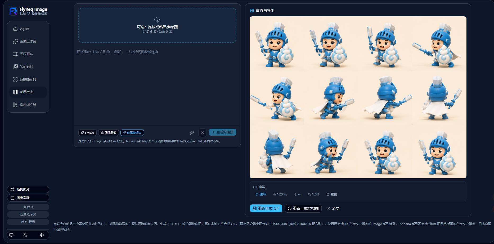
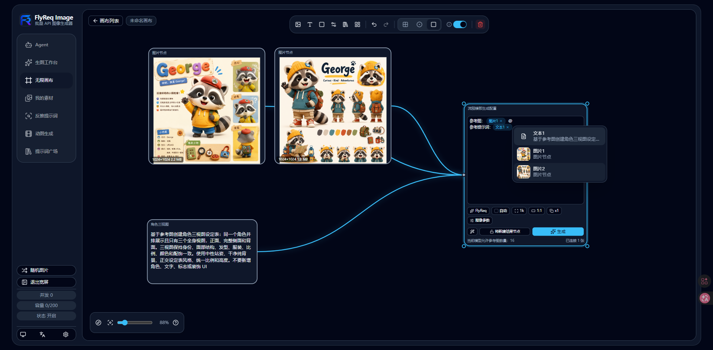
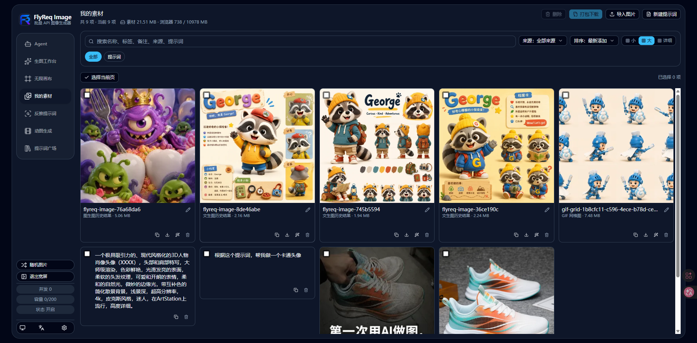

# FlyReq Image Studio

<p align="right"><strong>English</strong> | <a href="./README.zh-CN.md">简体中文</a></p>

<div align="center">

**A self-hosted AI image studio for multi-model workflows, real-time jobs, and production deployments.**

[](https://github.com/doudou770/flyreq-image-studio)
[](LICENSE)
[](https://nodejs.org)
[](https://nextjs.org)
[](https://react.dev)

</div>

---

## Overview

FlyReq Image Studio is a self-hosted workspace for AI image generation. It combines a static Next.js 16 + React 19 PWA frontend with a lightweight Node.js, SQLite, and WebSocket backend that queues jobs and proxies image-generation APIs.

Built from [tianjiangqiji/nova-image-studio](https://github.com/tianjiangqiji/nova-image-studio) and maintained at [doudou770/flyreq-image-studio](https://github.com/doudou770/flyreq-image-studio).

### Highlights

- **Provider-neutral models:** Image and text models are configured independently, each with its own API key, base URL, protocol, and capability limits.
- **Capability-aware controls:** Reference-image limits, output resolution, temperature, transparent backgrounds, quality, style, and output formats appear only when the selected model supports them.
- **Deployment-ready defaults:** Configure the first image model, product name, logo, icon, queue concurrency, and rate limits through environment variables without overwriting existing users' local models.
- **Model setup from a link:** Providers and team portals can prefill a model's protocol, model ID, base URL, and capabilities through a URL. Settings open automatically, but the user must confirm before anything is saved.
- **Reliable long-running jobs:** OpenAI Images-compatible endpoints can use streaming image requests. Public base URLs can be rewritten to Docker-internal addresses to avoid reverse-proxy and Cloudflare timeouts.
- **Actionable failures:** Upstream errors are clearly marked while preserving the original response body. A 504 response explicitly asks the user to retry.
- **Local-first workspace:** Browser-side configuration, job history, and assets can be backed up and restored.

> Current release: **v1.5.1**

## Sponsor

<table>
  <tr>
    <td width="180" align="center">
      <a href="https://flyreq.com">
        
      </a>
    </td>
    <td>
      <strong>Thanks to <a href="https://flyreq.com">FlyReq</a> for sponsoring this project.</strong><br /><br />
      FlyReq is an AI model API relay platform focused on high-discount access for developers and teams looking for a cost-effective way to connect the models they need.<br /><br />
      New registrations receive trial credit for validating model capabilities and integration flows. Visit <a href="https://flyreq.com">flyreq.com</a> to learn more and get started.
    </td>
  </tr>
</table>

---

## Product Preview

### Image Workspace

| Wide | Narrow | Mobile |
|:---:|:---:|:---:|
|  |  |  |

### Agent Mode

| Planning | Generation |
|:---:|:---:|
|  |  |

### GIF Workflow

| Generation | Refinement |
|:---:|:---:|
|  |  |

### Infinite Canvas



### Prompt Optimization

| Entry point | Result |
|:---:|:---:|
|  |  |

### Inspiration and Assets

| Prompt Gallery | My Assets |
|:---:|:---:|
|  |  |

### Configuration and Creation

| Reverse Prompt | Settings |
|:---:|:---:|
|  |  |

---

## Workflows

| Workflow | What it does |
| --- | --- |
| Text to Image | Generate images from prompts with parallel output support. |
| Image to Image | Edit, transform, or stylize uploaded reference images. |
| Agent | Turn multi-turn chat into an image plan and generation request, with vision descriptions, web search, and reasoning support. |
| Reverse Prompt | Stream a prompt analysis from an uploaded image through a configured text model. |
| GIF Generation | Generate multiple frames, assemble a grid, and encode the GIF in the browser with `gifenc`. |
| Infinite Canvas | Arrange images and text on a visual workspace, then pass connected context into image generation. |

## Supported Models and Protocols

| Type | Built-in presets or protocol | Available capabilities |
| --- | --- | --- |
| Google image models | Gemini 2.5 Flash Image, Gemini 3 Pro Image Preview, Gemini 3.1 Flash Image Preview, Gemini 3.1 Flash Lite Image | Text-to-image, image-to-image, model-specific reference-image limits, 1K to 4K output, and optional `temperature`. |
| OpenAI image models | GPT Image 2 and OpenAI Images-compatible endpoints | GPT Image 2 supports text-to-image, image-to-image, up to 16 references, 1K to 4K, quality, style, transparent backgrounds, PNG/JPEG/WebP, custom sizes, and streaming image requests. Compatible gateways expose the parameters their upstream supports. |
| xAI image models | Grok Imagine and Grok Imagine Quality | xAI Imagine request adapter, 1K or 2K output, and preset-supported aspect ratios. |
| Text models | Google `generateContent` and OpenAI Responses-compatible endpoints | Reverse prompting, prompt optimization, and Agent chat-to-image planning. |
| Custom models | `google` or `openai` compatible services | Custom model ID, base URL, API key, reference-image limit, output limit, and capability toggles. |

Presets define a safe capability boundary, not a provider lock-in. Supply the actual base URL, model ID, and API key for a compatible service. Google and xAI image APIs do not receive `stream=true`; OpenAI Images-compatible GPT Image 2 requests can enable streaming by default.

### Why It Is Different

- **Intent-aware Agent routing:** The Agent considers the requested resolution, available image models, and reference-image aspect ratio, then normalizes settings to the selected model's supported range.
- **One configuration surface:** Deployment variables provide a branded first-run experience, while external links can hand users a model draft that still requires confirmation.
- **Compatibility with diagnostics:** Server-side base-URL rewrites route public settings to internal services without changing what users saved. Upstream response bodies are retained for investigation.
- **Recoverable job system:** SQLite-backed jobs, WebSocket updates, reconnect with polling fallback, on-disk outputs, retry, download, backup, and restore are built in.

## Prompt Gallery

`PROMPT_GALLERY_MODE` controls how the gallery is exposed:

- `1`: Always visible.
- `2`: Private, protected by `PROMPT_GALLERY_PASSWORD`.
- `3`: Hidden.

Gallery content lives in `backend/prompts.json` and supports filtering through `backend/blacklist.json`.

## External Model Configuration Links

External sites can link to FlyReq Image with a `provider` query parameter containing model configuration JSON. The application opens Settings, fills the draft, removes the parameter from the address bar, and waits for the user to save it.

```json
{
  "type": "image",
  "preset": "gpt-image-2",
  "provider": "openai",
  "modelKey": "flyreq-gpt-image-2",
  "name": "FlyReq",
  "modelId": "gpt-image-2",
  "baseUrl": "https://flyreq.com",
  "apiKey": "YOUR_API_KEY",
  "maxRefImages": 16,
  "maxOutputSize": "4K",
  "supportsTemperature": false,
  "streamImages": true
}
```

Use URL-encoded JSON in production links. Matching first uses `modelKey`, then `name + modelId + baseUrl`; otherwise, a new model is drafted. The API key is removed from the address bar after parsing, but it is briefly present in the URL, so distribute these links carefully.

## Deployment

### Docker Compose

```bash
git clone https://github.com/doudou770/flyreq-image-studio.git
cd flyreq-image-studio
cp backend/.env.example .env
docker compose up -d
```

Open `http://localhost:3001` after startup. The compose setup persists task data and generated images under `data/`.

At first run, the configured deployment default image model is available as a draft, but API keys are never delivered through the deployment configuration. Add an image-model API key and at least one text model with its API key in **Settings**, then select defaults for the relevant workflows.

### Development

```bash
npm run install:all
npm run dev
```

The application is available at `http://localhost:3001`.

### Important Environment Variables

| Variable | Purpose |
| --- | --- |
| `FLYREQ_PLATFORM_NAME` | Product name used in the title, header, Settings, and PWA manifest. |
| `FLYREQ_PLATFORM_LOGO_URL` | Header logo URL. |
| `FLYREQ_PLATFORM_ICON_URL` | Browser favicon and PWA icon URL. |
| `FLYREQ_DEFAULT_IMAGE_MODEL_*` | Deployment-level first image model for users without a local model registry. |
| `FLYREQ_DEFAULT_IMAGE_MODEL_STREAM_IMAGES` | Enables streaming by default for GPT Image 2 on OpenAI Images-compatible endpoints. |
| `FLYREQ_BASE_URL_REWRITE_MAP` | JSON mapping that routes configured public base URLs to internal addresses. |
| `FLYREQ_TASK_CONCURRENCY` | Maximum server-side concurrent jobs. |
| `FLYREQ_RATE_LIMIT_*` | Per-client and global rate-limit controls. |
| `PROMPT_GALLERY_MODE` | Shows, protects, or hides the Prompt Gallery. |

For example, keep a public URL in browser-side model settings while routing server-side requests to a Docker network service:

```env
FLYREQ_BASE_URL_REWRITE_MAP={"https://flyreq.com":"http://new-api:3000"}
```

This mapping changes only outbound server requests. It never rewrites the user's stored model configuration.

## Task System

- Jobs enter a server-side queue with configurable concurrency and rate limits.
- Browsers receive job and queue changes through WebSocket, reconnect automatically, and fall back to HTTP polling after repeated failures.
- Generated files are stored on disk and served from `/api/flyreq/images/:taskId/:index`.
- Jobs expire after 12 hours and are cleaned up automatically.
- A restart marks incomplete jobs as failed and removes their partial output, preventing orphaned tasks.

## API

| Method | Path | Purpose |
| --- | --- | --- |
| `POST` | `/api/flyreq/tasks` | Submit an image-generation task. |
| `GET` | `/api/flyreq/tasks/:taskId` | Read task status and results. |
| `POST` | `/api/flyreq/tasks/:taskId/retry` | Retry a failed task. |
| `GET` | `/api/flyreq/config` | Read browser runtime configuration. |
| `GET` | `/api/flyreq/manifest.webmanifest` | Read the runtime PWA manifest. |
| `WS` | `/api/flyreq/ws` | Subscribe to task and queue updates. |

## Release

The repository includes a manual release workflow at `.github/workflows/release.yml`. Run **Actions -> Release -> Run workflow** on `master`, select `patch`, `minor`, or `major`, and the workflow will:

- Calculate the next semantic version from the latest `vX.Y.Z` tag.
- Build and publish Docker images to GitHub Container Registry.
- Pass the release version into the image as `APP_VERSION`, which is displayed in the UI and backup metadata.
- Create and push the Git tag, then create a GitHub Release with generated notes.

## Troubleshooting

**Why can an upstream console show success while FlyReq Image reports 504?**

Cloudflare, Nginx, or another gateway can close a long-running response before the upstream image job finishes. Prefer a Docker-internal or DNS-only upstream address, configure `FLYREQ_BASE_URL_REWRITE_MAP`, and enable streaming image requests for compatible OpenAI Images endpoints. The original upstream error is kept in the task failure message.

---

## Star History

<a href="https://www.star-history.com/?repos=doudou770%2Fflyreq-image-studio&type=date&legend=top-left">
  <picture>
    <source media="(prefers-color-scheme: dark)" srcset="https://api.star-history.com/chart?repos=doudou770/flyreq-image-studio&type=date&theme=dark&legend=top-left" />
    <source media="(prefers-color-scheme: light)" srcset="https://api.star-history.com/chart?repos=doudou770/flyreq-image-studio&type=date&legend=top-left" />
    
  </picture>
</a>

---

## License

Released under the [AGPL-3.0](LICENSE) license.

For the complete Chinese deployment guide, environment-variable reference, and operational FAQ, see [README.zh-CN.md](./README.zh-CN.md).
